# Moodit Component Architecture

## Purpose

This diagram represents the current high-level architecture of Moodit. It
focuses on MVVM responsibilities, image-processing paths, AI integration, and
project persistence rather than listing every widget or model class.

## Component Diagram

```mermaid
flowchart TB
    User([User])

    subgraph Views["Flutter Views"]
        Home["HomeScreen<br/>Import + draft recovery"]
        Projects["ProjectsScreen<br/>Saved projects"]
        Presets["MyPresetsScreen<br/>Global recipe management + selection"]
        Details["ProjectDetailsScreen<br/>Rename + delete"]
        Editor["EditorScreen<br/>Editor workspace"]
        Panels["Basic / Selective / Grading / AI panels"]
        Settings["AiSettingsScreen"]
    end

    subgraph ViewModels["ViewModels"]
        HomeVM["HomeViewModel"]
        ProjectsVM["ProjectsViewModel"]
        PresetsVM["PresetsViewModel"]
        DetailsVM["ProjectDetailsViewModel"]
        EditorVM["EditorViewModel<br/>editing coordinator"]
        SettingsVM["AiSettingsViewModel"]
    end

    subgraph Models["Editing State Models"]
        ProjectModel["EditorProject + EditorVersion"]
        State["EditorEditState<br/>Edit / ColorEdit / ColorGradingEdit"]
        PresetModel["EditorPreset<br/>Global active edit recipe"]
        History["EditorHistorySnapshot<br/>Undo / Redo per version"]
        Chat["ChatMessage<br/>AI history per version"]
        Frame["RgbaImageFrame"]
    end

    subgraph Domain["Domain Logic"]
        Parser["parseEditsJson<br/>AI JSON validation"]
        Pipeline["Edit Pipeline"]
        Basic["Basic operations"]
        Selective["Selective color operations"]
        Grading["Color grading operations"]
        Caches["Stage + preparation caches"]
    end

    subgraph Services["Application Services"]
        Decoder["PreviewImageDecoder<br/>1080 preview input"]
        Worker["EditPipelineWorker<br/>preview isolate"]
        Export["ExportService<br/>full-resolution export isolate"]
        Files["ProjectFileStore"]
        Gemini["GeminiProvider<br/>AiProvider implementation"]
        Profiles["AiProfilesStorage"]
        Keys["AiProfilesApiKeyStorage"]
    end

    subgraph Persistence["Persistence Layer"]
        Repo["EditorProjectRepository"]
        DriftRepo["DriftEditorProjectRepository"]
        PresetRepo["PresetRepository"]
        DriftPresetRepo["DriftPresetRepository"]
        Database["AppDatabase / Drift"]
        Daos["Project / Version / AI Chat / Preset DAOs"]
        SQLite[("SQLite<br/>projects, versions, AI messages, presets")]
    end

    subgraph External["External Resources"]
        GeminiApi[("Gemini REST API")]
        AppFiles[("Application file system<br/>originals, previews, thumbnails")]
        Gallery[("Device gallery")]
        Secure[("Secure storage<br/>API keys")]
        Preferences[("Shared preferences<br/>AI profiles")]
    end

    User --> Home
    User --> Editor
    User --> Projects
    User --> Presets
    User --> Settings
    Editor --> Panels
    Projects --> Details

    Home --> HomeVM
    Projects --> ProjectsVM
    Presets --> PresetsVM
    Details --> DetailsVM
    Editor --> EditorVM
    Panels --> EditorVM
    Settings --> SettingsVM
    Settings -->|save callback| EditorVM

    HomeVM --> Repo
    HomeVM --> Files
    ProjectsVM --> Repo
    DetailsVM --> Repo
    DetailsVM --> Files

    EditorVM --> ProjectModel
    EditorVM --> State
    EditorVM --> PresetModel
    EditorVM --> History
    EditorVM --> Chat
    EditorVM --> Decoder
    EditorVM --> Worker
    EditorVM --> Export
    EditorVM --> Files
    EditorVM --> Gemini
    EditorVM --> Repo
    EditorVM --> PresetRepo
    EditorVM --> Profiles
    EditorVM --> Keys

    Decoder --> Frame
    Worker --> Frame
    Worker --> Pipeline
    Worker --> Caches
    Export --> Pipeline
    Pipeline --> Basic --> Selective --> Grading
    Caches -. accelerates .-> Selective
    Caches -. accelerates .-> Grading

    Gemini -->|JSON response| EditorVM
    EditorVM --> Parser
    Gemini --> GeminiApi

    Repo --> DriftRepo --> Database --> Daos --> SQLite
    PresetRepo --> DriftPresetRepo --> Database
    PresetsVM --> PresetRepo
    Files --> AppFiles
    Export --> Gallery
    Keys --> Secure
    Profiles --> Preferences
```



## Main Responsibilities

| Area | Responsibility |
| --- | --- |
| Views | Render screens, panels, dialogs, and user interactions. |
| ViewModels | Coordinate use cases, expose UI state, and keep views independent from storage/domain implementation details. |
| EditorViewModel | Central editor orchestration: edits, previews, AI pending edits, undo/redo, versions, persistence, and export. |
| Domain Logic | Validate structured AI edits and perform local image transformations. |
| Services | Isolate execution, preview decoding, original-resolution export, file ownership, AI provider access, and settings storage. |
| Repository / Drift | Persist projects, versions, version-specific AI conversation history, and global reusable presets. |

## Processing Paths

### Interactive Preview

```text
Editor UI -> EditorViewModel -> EditPipelineWorker isolate
          -> cached local pipeline -> RgbaImageFrame -> image preview
```

Preview editing uses the working-resolution frame for responsive interaction.

### Full-Resolution Export

```text
Editor UI -> EditorViewModel -> ExportService isolate
          -> app-owned original image path -> full pipeline -> gallery output
```

Export re-applies the edit recipe to the stored original image, rather than
exporting the reduced preview.

### AI-Assisted Edit

```text
AI Chat -> EditorViewModel -> GeminiProvider -> Gemini API
        <- JSON edit parameters <- response
        -> parseEditsJson -> pending local edits -> preview pipeline
```

The model proposes structured parameters; image processing remains inside the
application.

## Related Diagram

The current relational database diagram is stored in:

```text
docs/db_plan/moodit_current_database_erd.dbml
```
